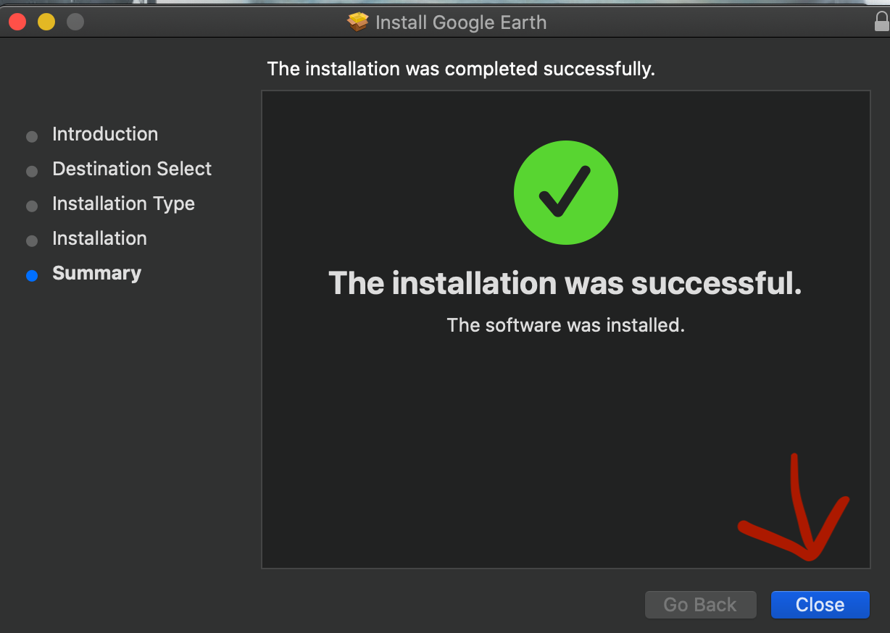

Installation
============
**Step1.** Go to https://www.google.com/earth/versions/#earth-pro
	-There you will see the button “Download Earth Pro on desktop” 
	click on that.

**Step 2.** Accept and download
	
**Step 3.** Once download is complete a window will pop up with a box inside
	-Double click on the box
.. image:: instr2.png

**Step 4.** Another window will pop up introducing the installation. 
	-Press continue
.. image:: instr11.png 

**Step 5.** The actual installation window is next.
	-press install
.. image:: install.png

**Step 6.** A window asking for the authorized users password will pop up. 
	-the password will be your computer password, enter than now 

	
**Step 7.** Once you enter the password and hit enter a window will pop up
	 saying the Installation was successful
	 -press the close button. 

**Step 8.** Open the application, the easiest way to open it is to bring up the 	search bar and type the application name.
     	-press Command + Space at the same time and type “Google Earth Pro” and 	hit enter
.. image:: instr5.png

